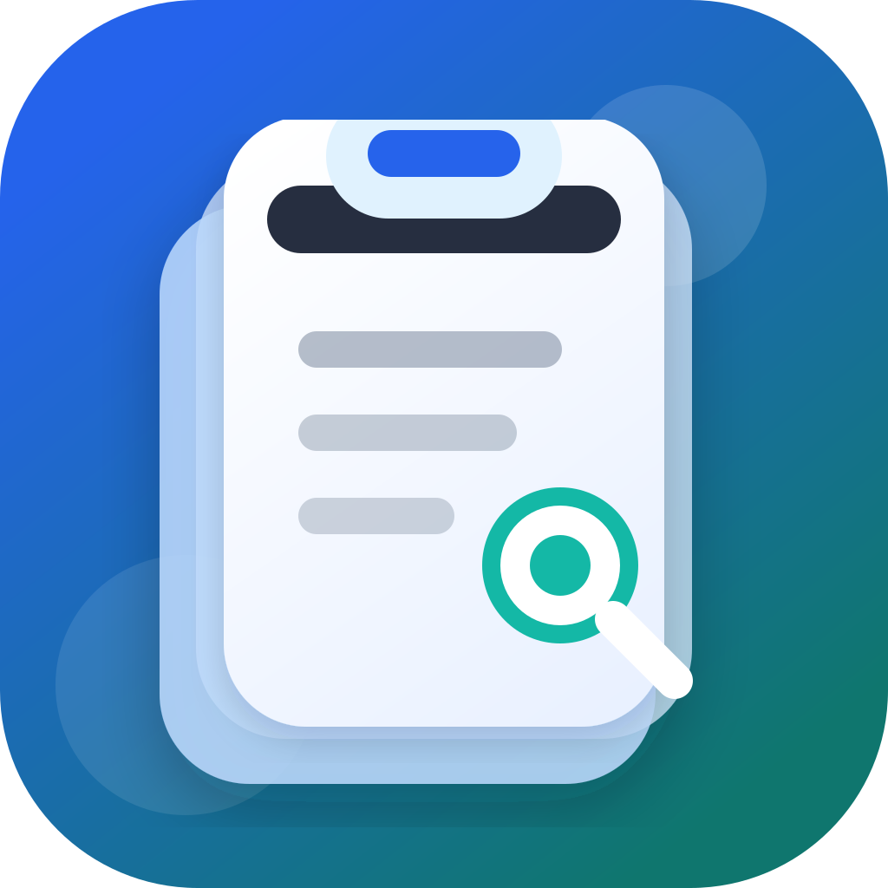

# Copy Pannel

<p align="center">
  
</p>

A macOS clipboard manager intended as a Clipy replacement, with better support for images, media files, and search while keeping a fast keyboard-driven workflow.

## Features

- Global shortcut: `CommandOrControl+Shift+V`
- Opens near the current mouse position and on the current display
- Tracks text, images, and file URL clipboard entries
- Stores copied images as local PNG assets and restores them back to the system clipboard
- Runs on-device OCR for copied images using Apple's Vision framework
- Searches recognized text from images
- Copies recognized image text from the history list
- Tracks videos and other media files as Finder file references
- Searches text, filenames, image dimensions, and OCR text
- Filters by type: All, Text, Image, Video, File
- `Enter` restores the selected item and hides the panel
- `Esc` hides the panel or closes settings/confirmation dialogs
- Deletes unused image cache files when history items are removed
- Uses an in-app confirmation dialog before clearing history

## Settings

Open settings from the top-right button.

- History limit: default `500`, range `50` to `5000`
- Clear search on open: enabled by default
- Current global shortcut display: `⌘ ⇧ V`

Settings are stored in Electron's `userData` directory and persist across restarts.

## Run

```bash
pnpm install
pnpm start
```

## Install From Release

The release build is not notarized because this project does not currently use an Apple Developer ID certificate.

If macOS shows a warning such as `"Copy Pannel" is damaged and can't be opened`, remove the quarantine attribute after installing the app:

```bash
xattr -dr com.apple.quarantine "/Applications/Copy Pannel.app"
```

If you are opening the app directly from the mounted DMG, use the path inside the volume instead:

```bash
xattr -dr com.apple.quarantine "/Volumes/Copy Pannel/Copy Pannel.app"
```

You can also try Finder's right-click `Open` flow. A fully trusted double-click install requires Apple Developer ID signing and notarization.

## Check

```bash
pnpm run check
```

## Build

```bash
pnpm run build
```

The build script compiles `native/ocr-helper.swift` into `resources/ocr-helper` before packaging the Electron app. The helper is included as an extra resource so release builds can run OCR without requiring Swift to be installed on the user's machine.

GitHub Actions builds the macOS app on push and pull requests. Pushing a tag named `v*`, for example `v0.1.1`, builds the app and publishes a GitHub release with the generated artifacts.

## Notes

Videos are usually not stored directly as binary clipboard data. They are commonly placed on the clipboard as file references or file URLs. Copy Pannel records and restores those references, which makes it suitable for copying media files between Finder, chat apps, and editors.

Image history is stored as local PNG files. When image records are deleted, history is cleared, or the history limit removes old items, unused image cache files are cleaned up automatically.

OCR runs locally through Apple's Vision framework on macOS. It defaults to simplified Chinese and English recognition when supported by the system, and falls back without breaking normal clipboard capture if OCR is unavailable or fails.
